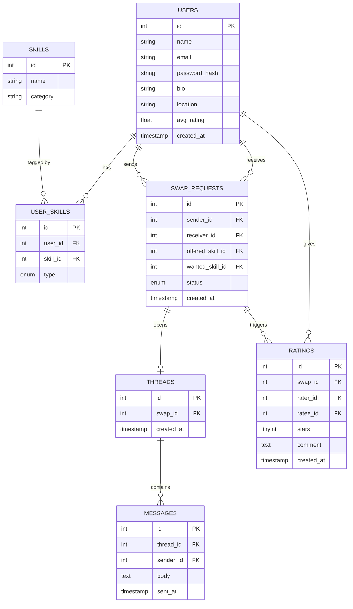

# SkillSwap

A web-based platform for skill trading where users can exchange knowledge and abilities without monetary transactions. Built with PHP, MySQL, and Tailwind CSS.

## Project Overview

SkillSwap is designed to facilitate peer-to-peer skill exchanges in a community-driven environment. Users create profiles listing skills they can teach and skills they want to learn. The platform's intelligent matching engine identifies potential swap partners based on complementary skills, ensuring mutually beneficial exchanges.

The application emphasizes simplicity, security, and user trust through features like secure authentication, real-time messaging, and a rating system. It's built as a semester project, focusing on core functionalities without complex features like real-time chat or admin analytics.

### Key Concepts

- **Skills**: Predefined list of skills (e.g., Cooking, Programming, Guitar) that users can offer or request.
- **Matching**: Direct matching where User A offers Skill X and wants Skill Y, and User B offers Skill Y and wants Skill X.
- **Swaps**: Structured requests with statuses (pending, accepted, declined, completed).
- **Messaging**: Thread-based chat for each swap to coordinate exchanges.
- **Ratings**: Post-swap feedback to maintain quality and trust.

## Features

- **User Authentication**: Secure login and registration system with password hashing.
- **Profile Management**: Users can create and edit profiles, including bio, location, and skill preferences (offered and wanted).
- **Skill Matching**: Intelligent matching engine that finds direct swap partners based on complementary skills.
- **Swap Requests**: Send and manage swap proposals with status tracking (pending, accepted, declined, completed).
- **Messaging**: WhatsApp-style chat interface for communicating during swaps, with real-time polling.
- **Ratings & Reviews**: Post-swap rating system to build trust and track user reputation.

## Technology Stack

- **Backend**: PHP 8.0+ with PDO for secure database interactions.
- **Database**: MySQL for data storage, with normalized schema for users, skills, swaps, messages, and ratings.
- **Frontend**: HTML5, Tailwind CSS for responsive, dark-themed UI, and vanilla JavaScript for dynamic interactions (e.g., message polling).
- **Server**: Designed for Apache/Nginx with PHP support (tested on XAMPP).
- **Security**: Session-based authentication, input sanitization, and SQL injection prevention via prepared statements.

## How It Works

### Matching Algorithm
The matching engine uses a SQL query to find users where:
- The current user offers a skill that another user wants.
- The other user offers a skill that the current user wants.
- The other user does not offer any skills that the current user offers (to avoid same-skill matches).
- No existing swap requests exist between them.

This ensures direct, complementary matches.

### User Flow
1. **Registration/Login**: New users register with name, email, password. Existing users log in.
2. **Profile Setup**: Edit profile to add bio, location, and select offered/wanted skills from a predefined list.
3. **Find Matches**: Visit the Match page to see potential swap partners.
4. **Send Request**: Click to send a swap request specifying offered and wanted skills.
5. **Respond**: Receive notifications; accept or decline requests.
6. **Communicate**: Use the chat thread to discuss details.
7. **Complete Swap**: Mark swap as done and rate the partner.

### Database Design
The schema includes tables for users, skills, user_skills (junction with type: offered/wanted), swap_requests, threads, messages, and ratings. Foreign keys ensure data integrity.

## Setup Instructions

Follow these steps to set up the SkillSwap project on your local machine:

1. **Clone or Download the Repository**:
   ```bash
   git clone <repository-url>
   ```
   Place the project folder (e.g., `skillswap`) inside your local web server's root directory (such as `htdocs` for XAMPP, or `www` for WAMP/MAMP).

2. **Start your Local Web Server**:
   Ensure you have a local PHP web server installed (like XAMPP, WAMP, or MAMP). Start both the **Apache** and **MySQL** services.

3. **Set up the Database**:
   - Open your database administration tool (such as phpMyAdmin, typically at `http://localhost/phpmyadmin`).
   - Create a new database (e.g., `skillswap`).
   - Import the provided SQL script located at `database/skillswap.sql` to set up the necessary tables and structure.

4. **Update Configuration**:
   - Locate and open the `config/db.php` file in your code editor.
   - Update the database credentials (username, password, and database name) to match your local MySQL configuration. For example, if using standard XAMPP, the username might be `root` with an empty password.
   - Similarly, update `config/constants.php` if you need to set a specific base URL.

5. **Access the Application**:
   Open a web browser and navigate to the project directory:
   ```text
   http://localhost/skillswap/
   ```

## Usage Guide

- **Landing Page**: Overview of the platform; redirects logged-in users to match page.
- **Profile Pages**: View your own or others' profiles; edit your own.
- **Match Page**: Lists potential matches; click to send requests.
- **Swaps Dashboard**: View all your sent/received requests; respond or complete.
- **Messages**: Access chat threads for active swaps.
- **Ratings**: Rate partners after completing swaps.

## Documentation

Here are the related documentation files and diagrams for the system:

### Architecture & Flow (Images)

- **System Architecture**:
  

- **Swap Flow**:
  

### Database Schema



### Folder Structure

```text
skillswap/
├── config/
│   ├── db.php (DB connection)
│   └── constants.php (base URL, site name)
├── includes/ (shared across all pages)
│   ├── header.php
│   ├── footer.php
│   ├── auth_check.php (session guard)
│   └── functions.php (sanitize, flash msgs)
├── auth/
│   ├── login.php
│   ├── register.php
│   └── logout.php
├── profile/
│   ├── view.php (?user_id=X)
│   ├── edit.php (offer + request skills)
│   └── update_skills.php (POST handler)
├── match/ (core feature)
│   └── index.php (runs match engine, lists results)
├── swaps/
│   ├── request.php (send swap request)
│   ├── respond.php (accept / decline)
│   ├── my_swaps.php (dashboard of all swaps)
│   └── complete.php (mark swap done)
├── messages/
│   ├── thread.php (?swap_id=X — private thread view)
│   ├── send.php (POST — insert new message)
│   └── fetch.php (AJAX — get new messages)
├── ratings/
│   └── rate.php (submit stars + comment)
├── assets/
│   ├── css/
│   │   └── style.css
│   ├── js/
│   │   └── main.js
│   └── img/ (placeholders)
├── database/
│   └── skillswap.sql (CREATE TABLE scripts)
├── docs/
│   ├── skillswap_db_schema.html
│   ├── skillswap_folder_structure.html
│   ├── skillswap_system_architecture.svg
│   └── skillswap_swap_flow.svg
└── index.php (landing / explore page)
```

