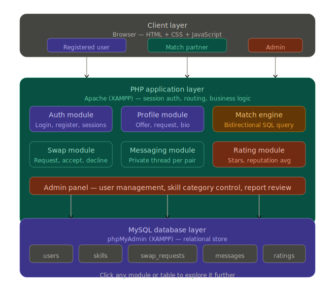
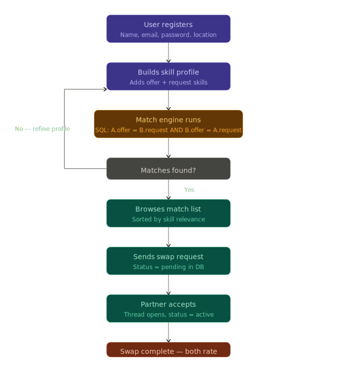
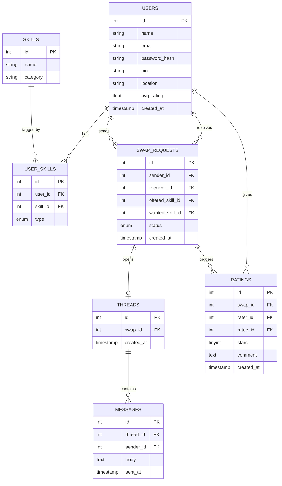

# SkillSwap

Welcome to the SkillSwap project repository! 

## Setup Instructions

Follow these steps to set up the SkillSwap project on your local machine:

1. **Clone or Download the Repository**:
   ```bash
   git clone <repository-url>
   ```
   Place the project folder (e.g., `skillswap`) inside your local web server's root directory (such as `htdocs` for XAMPP, or `www` for WAMP/MAMP).

2. **Start your Local Web Server**:
   Ensure you have a local PHP web server installed (like XAMPP, WAMP, or MAMP). Start both the **Apache** and **MySQL** services.

3. **Set up the Database**:
   - Open your database administration tool (such as phpMyAdmin, typically at `http://localhost/phpmyadmin`).
   - Create a new database (e.g., `skillswap`).
   - Import the provided SQL script located at `database/skillswap.sql` to set up the necessary tables and structure.

4. **Update Configuration**:
   - Locate and open the `config/db.php` file in your code editor.
   - Update the database credentials (username, password, and database name) to match your local MySQL configuration. For example, if using standard XAMPP, the username might be `root` with an empty password.
   - Similarly, update `config/constants.php` if you need to set a specific base URL.

5. **Access the Application**:
   Open a web browser and navigate to the project directory:
   ```text
   http://localhost/skillswap/
   ```

## Documentation

Here are the related documentation files and diagrams for the system:

### Architecture & Flow (Images)

- **System Architecture**:
  

- **Swap Flow**:
  

### Database Schema



### Folder Structure

```text
skillswap/
├── config/
│   ├── db.php (DB connection)
│   └── constants.php (base URL, site name)
├── includes/ (shared across all pages)
│   ├── header.php
│   ├── footer.php
│   ├── auth_check.php (session guard)
│   └── functions.php (sanitize, flash msgs)
├── auth/
│   ├── login.php
│   ├── register.php
│   └── logout.php
├── profile/
│   ├── view.php (?user_id=X)
│   ├── edit.php (offer + request skills)
│   └── update_skills.php (POST handler)
├── match/ (core feature)
│   ├── index.php (runs match engine, lists results)
│   └── match_engine.php (bidirectional SQL)
├── swaps/
│   ├── request.php (send swap request)
│   ├── respond.php (accept / decline)
│   ├── my_swaps.php (dashboard of all swaps)
│   └── complete.php (mark swap done)
├── messages/
│   ├── thread.php (?swap_id=X — private thread view)
│   └── send.php (POST — insert new message)
├── ratings/
│   ├── rate.php (submit stars + comment)
│   └── update_avg.php (recalculate user avg_rating)
├── admin/
│   ├── index.php (dashboard overview)
│   ├── users.php
│   ├── skills.php (manage skill categories)
│   └── reports.php
├── assets/
│   ├── css/
│   │   └── style.css
│   ├── js/
│   │   ├── main.js
│   │   └── match_filter.js (live JS filter on match page)
│   └── img/ (avatars, placeholders)
├── database/
│   └── skillswap.sql (CREATE TABLE scripts)
└── index.php (landing / explore page)
```
